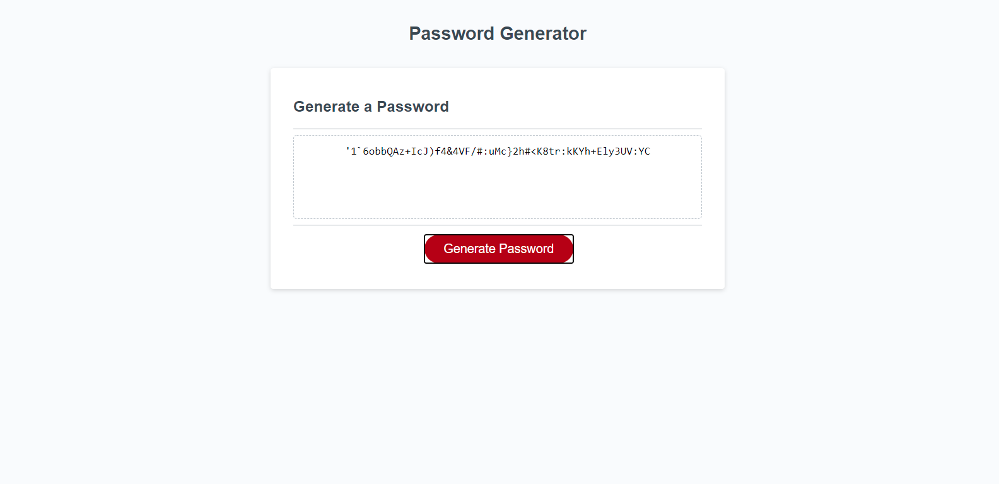

# password-generator

For this project, I was tasked with creating a password generator. The generator requires the user to specify the length of the password (between 8 and 128 characters) and whether or not it includes lowercase letters, uppercase letters, numbers or special characters. 

https://jacobmabob.github.io/password-generator/

